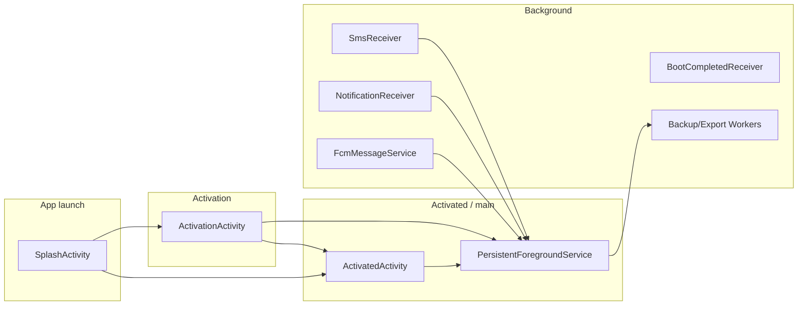

# API Calls by UI / Flow

All HTTP calls go through `FASTPAY_BASE/app/src/main/java/com/example/fast/util/DjangoApiHelper.kt`. This document maps each API to the **UI screen or background component** that triggers it. For endpoint details and request/response shapes, see [Django API](04-django-api.md).

---

## Flow overview

---

## 1. Splash screen (SplashActivity)

| API | Method | Endpoint | When it runs (UI spot) |
|-----|--------|----------|------------------------|
| Register device | POST | `/devices/` | **Right after splash starts**: `registerDeviceEarly()` in `onCreate()` — fires once with base device data; may fire again after Firebase read (with `isActive`/`code`) or on Firebase timeout/error with basic data. |
| Register device | POST | `/devices/` | **After activation check**: When Firebase says device is "fully activated" (isActive + code + device-list match), `checkActivationStatus()` calls `DjangoApiHelper.registerDevice(deviceId, map)` before navigating to ActivatedActivity. |
| Validate code | POST | `/validate-login/` | **Only when Firebase is slow or fails**: From `tryDjangoThenLocalFallback()` — used when Firebase times out (2s) or returns error during activation check; result decides navigate to ActivationActivity vs ActivatedActivity. |

**Files:** `FASTPAY_BASE/app/src/main/java/com/example/fast/ui/SplashActivity.kt` (e.g. ~249, ~286, ~306, ~708, ~886).

---

## 2. Activation screen (ActivationActivity)

| API | Method | Endpoint | When it runs (UI spot) |
|-----|--------|----------|------------------------|
| Validate code (RUNNING) | POST | `/validate-login/` | **User submits activation code**: From `validateBankCode()` → `DjangoApiHelper.isValidCodeLogin(code, deviceId)` when in RUNNING mode (code-only). |
| Register device | POST | `/devices/` | **After successful activation**: Multiple spots — e.g. after Firebase device update in RUNNING flow (`handleActivationDirect`), in code-conflict flow (`handleCodeConflict`), and in TESTING flow after Firebase updates. |
| Register bank number (TESTING) | POST | `/registerbanknumber` | **TESTING mode only**: From `reportBankNumberIfNeeded()` after Firebase device update (e.g. in `handleCodeConflict` and similar TESTING success paths). |
| Log activation failure | POST | `/activation-failure-logs/` | **When activation fails**: From `reportActivationFailure()` — on invalid code, network error, timeout, Firebase error, etc.; shows error UI and may queue retry. |

**Foreground service start:** When activation succeeds, `ActivationActivity` starts `PersistentForegroundService` if not already running (~line 900).

**Files:** `FASTPAY_BASE/app/src/main/java/com/example/fast/ui/ActivationActivity.kt` (e.g. ~2824, ~3011, ~3070, ~3128, ~3291, ~3338, ~3425, ~3493, ~3605).

---

## 3. Activated (main) screen and its background

**ActivatedActivity** does not call Django directly. It triggers:

- **PermissionFirebaseSync** (e.g. after permission grants/denials) → which calls **PATCH `/devices/{id}/`** (permission fields) from `PermissionFirebaseSync.kt`.
- **PersistentForegroundService** start/ensure-running via `ActivatedServiceManager`.

So on the **main UI**, the only API that is "from the activated screen" in practice is:

| API | Method | Endpoint | When it runs (UI spot) |
|-----|--------|----------|------------------------|
| Patch device | PATCH | `/devices/{id}/` | **When user grants/denies permissions** (SMS, contacts, phone state, notifications, battery) or when syncing all permission status; runs from `PermissionFirebaseSync.updatePermissionStatus()` / `syncPermissionStatus()` called from ActivatedActivity. |

**Files:** `FASTPAY_BASE/app/src/main/java/com/example/fast/ui/ActivatedActivity.kt` (e.g. ~3187, ~3239, ~3312, ~3315–3317, ~3325, ~3329, ~3333), `FASTPAY_BASE/app/src/main/java/com/example/fast/util/PermissionFirebaseSync.kt` (~59).

---

## 4. PersistentForegroundService (background, after activation)

This service is started from ActivationActivity (on success) or ActivatedActivity/ActivatedServiceManager and runs in the background. It drives most sync and command APIs.

| API | Method | Endpoint | When it runs (UI spot) |
|-----|--------|----------|------------------------|
| Patch device | PATCH | `/devices/{id}/` | **Sync metadata**: After message/contact/notification batch flushes or sync-state changes (`sync_metadata`). **System info**: From `DeviceInfoCollector.collectAllDeviceInfo()` (periodic/subtask). **is_active**: On service destroy (set `is_active` to false). |
| Log command | POST | `/command-logs/` | **After executing a remote command**: e.g. sendSms, backupMessages, exportMessages, executeWorkflow, etc.; status (success/failed) and optional error message sent. |
| Sync messages | POST | `/messages/` | **Indirect**: Service initializes and flushes `SmsMessageBatchProcessor` (and others); the actual POST is inside `SmsMessageBatchProcessor.kt` when batch is flushed. |
| Sync contacts | POST | `/contacts/` | **Indirect**: Same as above; actual POST in `ContactBatchProcessor.kt`. |
| Sync notifications | POST | `/notifications/` | **Indirect**: Same; actual POST in `NotificationBatchProcessor.kt`. |

**Files:** `FASTPAY_BASE/app/src/main/java/com/example/fast/service/PersistentForegroundService.kt` (e.g. ~558, ~602, ~634, ~1040, ~1056, ~1088, ~2272, ~2329, ~2409, ~2476–2480, ~3639, ~3645). Device patch also from `FASTPAY_BASE/app/src/main/java/com/example/fast/util/DeviceInfoCollector.kt` (~247).

---

## 5. Receivers and FCM (no direct UI)

| API | Method | Endpoint | When it runs (UI spot) |
|-----|--------|----------|------------------------|
| Sync messages | POST | `/messages/` | **New SMS received**: `SmsReceiver` pushes to `SmsMessageBatchProcessor`; batch flush (by service or timer) sends to Django. User sees no dedicated "API" screen. |
| Sync contacts | POST | `/contacts/` | **Contact sync**: `ContactSmsSyncService` queues contacts into `ContactBatchProcessor`; flush sends to Django. |
| Sync notifications | POST | `/notifications/` | **New notification**: `NotificationReceiver` queues into `NotificationBatchProcessor`; `FcmMessageService` or service can trigger flush. |
| Register FCM token | POST | `/fcm-tokens/` | **App / FCM**: When `FcmTokenManager` gets a token (e.g. `onNewToken()` from `FcmMessageService`) or on init if token changed. No specific screen. |
| Unregister FCM token | POST | `/fcm-tokens/unregister/` | **On logout / unregister**: `FcmTokenManager.unregisterToken()`. Typically logout or deactivation. |

**Files:** `FASTPAY_BASE/app/src/main/java/com/example/fast/service/notification/FcmTokenManager.kt` (~111, ~133), `SmsReceiver.kt`, `ContactBatchProcessor.kt` (~333), `NotificationBatchProcessor.kt` (~335, ~584).

---

## 6. Auto-reply (background)

| API | Method | Endpoint | When it runs (UI spot) |
|-----|--------|----------|------------------------|
| Get device config | GET | `/devices/{id}/` | **Auto-reply config load**: `AutoReplyManager` fetches device (e.g. `auto_reply_config`) when processing incoming SMS. |
| Patch device | PATCH | `/devices/{id}/` | **Auto-reply metadata**: When saving auto-reply config to backend (`sync_metadata`). |
| Log auto-reply | POST | `/auto-reply-logs/` | **After sending auto-reply**: When an incoming SMS is auto-replied. |

**Files:** `FASTPAY_BASE/app/src/main/java/com/example/fast/util/AutoReplyManager.kt` (~72, ~250, ~275). Triggered from `SmsReceiver` and from `PersistentForegroundService` (load/setup).

---

## 7. Workers (remote-command driven)

| API | Method | Endpoint | When it runs (UI spot) |
|-----|--------|----------|------------------------|
| Log command | POST | `/command-logs/` | **After backup/export job**: `BackupMessagesWorker` and `ExportMessagesWorker` report status (success/failure) when the work finishes. Triggered by remote `backupMessages` / `exportMessages` command handled in PersistentForegroundService. |

**Files:** `FASTPAY_BASE/app/src/main/java/com/example/fast/workers/BackupMessagesWorker.kt` (~108), `FASTPAY_BASE/app/src/main/java/com/example/fast/workers/ExportMessagesWorker.kt` (~89).

---

## Summary table (by endpoint)

| # | Method | Endpoint | Trigger (UI / flow) |
|---|--------|----------|---------------------|
| 1 | POST | `/devices/` | Splash (early + after activation check), Activation (after success, multiple paths) |
| 2 | PATCH | `/devices/{id}/` | Activated (permissions), PersistentForegroundService (sync_metadata, system_info, is_active), PermissionFirebaseSync, DeviceInfoCollector, AutoReplyManager |
| 3 | GET | `/devices/{id}/` | AutoReplyManager (load config) |
| 4 | POST | `/messages/` | SmsMessageBatchProcessor (flush from service / SmsReceiver) |
| 5 | POST | `/contacts/` | ContactBatchProcessor (flush from service / ContactSmsSyncService) |
| 6 | POST | `/notifications/` | NotificationBatchProcessor (flush from service / NotificationReceiver / FCM) |
| 7 | POST | `/command-logs/` | PersistentForegroundService (after each command), BackupMessagesWorker, ExportMessagesWorker |
| 8 | POST | `/auto-reply-logs/` | AutoReplyManager (after sending auto-reply) |
| 9 | POST | `/activation-failure-logs/` | ActivationActivity (`reportActivationFailure`) |
| 10 | POST | `/registerbanknumber` | ActivationActivity (TESTING mode only, after Firebase update) |
| 11 | POST | `/validate-login/` | Splash (Firebase fallback), ActivationActivity (RUNNING code submit) |
| 12 | POST | `/fcm-tokens/` | FcmTokenManager (onNewToken / init) |
| 13 | POST | `/fcm-tokens/unregister/` | FcmTokenManager (unregister flow) |
