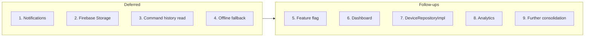

# Firebase vs Django Migration – Future Scope

Post-migration work: items deferred or to do after Tasks 1–19 are done. This doc gives **priorities**, **suggested order**, and **subtasks** for each.

**Prerequisite:** Main migration (see [firebase-django-migration-breakdown.md](firebase-django-migration-breakdown.md)) completed or in progress as needed.

---

## Suggested execution order

Do **Deferred** items first (decide and implement), then **Follow-ups** in order 5–9.

---

## Deferred / decide later

### 1. Notifications (Task 14) – Priority: High

**Decide:** Keep Firebase for real-time vs move to Django + polling.

| # | Subtask |
|---|--------|
| 1.1 | Decide: real-time required for dashboard or OK with polling. |
| 1.2 | If Django: add GET `/devices/{id}/notifications/` (Task 4); app/dashboard fetch on interval or on demand. |
| 1.3 | If Django: stop writing to Firebase `notification/{deviceId}`; keep POST `/notifications/`. |
| 1.4 | If keep Firebase: document and leave as-is. |

---

### 2. Firebase Storage (Task 17) – Priority: High

**Decide:** Keep `inputs/{deviceId}/` and `app/apk/` in Firebase or move to Django/signed URLs.

| # | Subtask |
|---|--------|
| 2.1 | List all app and dashboard usages of Firebase Storage (inputs, app/apk). |
| 2.2 | Decide: keep in Firebase vs Django-backed URLs (signed or direct). |
| 2.3 | If move: add Django endpoints or storage adapter; update app and dashboard to use new URLs. |
| 2.4 | Update docs (05-firebase.md, 04-django-api.md). |

---

### 3. Command history read (Tasks 5, 13) – Priority: Medium

**Optional:** GET command-logs for dashboard; app UI if needed.

| # | Subtask |
|---|--------|
| 3.1 | Decide: does dashboard need to read command logs from server? |
| 3.2 | If yes: add GET `/devices/{id}/command-logs/` (pagination, filters). |
| 3.3 | Dashboard: switch to Django for command history; remove Firebase commandHistory read if any. |
| 3.4 | Optional: app UI to show recent commands from Django. |

---

### 4. Offline / fallback – Priority: Medium

**Decide:** Cache or Firebase fallback when Django is down (not in first cut).

| # | Subtask |
|---|--------|
| 4.1 | Define which data (e.g. app config, filter) may be cached when Django unavailable. |
| 4.2 | Add in-memory or short-lived cache for GET app-config / device filter; TTL and invalidation. |
| 4.3 | Optional: Firebase fallback for app config (version, force update) when Django fails; document. |
| 4.4 | Test offline behavior and document for support. |

---

## Possible follow-ups

### 5. Feature flag – Priority: High

Toggle Django vs Firebase per feature for rollout or rollback.

| # | Subtask |
|---|--------|
| 5.1 | Define flag names (e.g. use_django_heartbeat, use_django_filter, use_django_app_config). |
| 5.2 | Add flags to app config (Django or build-time); read at runtime. |
| 5.3 | Gate heartbeat, filter, app config (and optionally contacts, animation) with flags. |
| 5.4 | Document how to flip flags and verify both paths. |

---

### 6. Dashboard – Priority: High

Use new Django endpoints; reduce Firebase reads for migrated data.

| # | Subtask |
|---|--------|
| 6.1 | Audit dashboard: which screens read device detail, filter, animation, contacts, command-logs from Firebase. |
| 6.2 | Switch those reads to Django GET endpoints (assumes Tasks 1–2, 5 done). |
| 6.3 | Remove or reduce Firebase listeners/reads for migrated data on dashboard. |
| 6.4 | Test dashboard with Django-only for migrated fields. |

---

### 7. DeviceRepositoryImpl – Priority: Medium

Switch or retire Firebase-based device/heartbeat methods.

| # | Subtask |
|---|--------|
| 7.1 | Find all callers of DeviceRepositoryImpl.getDeviceInfo, getHeartbeat, updateHeartbeat. |
| 7.2 | If used: implement via Django (GET /devices/{id}/, PATCH for heartbeat); remove Firebase in impl. |
| 7.3 | If unused: deprecate and remove or leave as legacy. |
| 7.4 | Update DeviceRepository interface and tests. |

---

### 8. Analytics / monitoring – Priority: Medium

Track Django vs Firebase usage after migration.

| # | Subtask |
|---|--------|
| 8.1 | Define metrics: Django vs Firebase call counts, latency, errors per endpoint/feature. |
| 8.2 | Add logging or analytics events in app (and optionally dashboard) for key calls. |
| 8.3 | Dashboard or report for migration health; alert on regressions. |

---

### 9. Further consolidation – Priority: Low

Consider moving more data to Django + FCM (not in current plan).

| # | Subtask |
|---|--------|
| 9.1 | Evaluate: instruction card or device list via Django + polling or FCM push. |
| 9.2 | If yes: design endpoint and push payload; app and dashboard changes. |
| 9.3 | Only if product requires it; current plan keeps these in Firebase. |

---

## Summary table

| Order | Item | Phase | Priority |
|-------|------|-------|----------|
| 1 | Notifications | Deferred | High |
| 2 | Firebase Storage | Deferred | High |
| 3 | Command history read | Deferred | Medium |
| 4 | Offline / fallback | Deferred | Medium |
| 5 | Feature flag | Follow-up | High |
| 6 | Dashboard | Follow-up | High |
| 7 | DeviceRepositoryImpl | Follow-up | Medium |
| 8 | Analytics / monitoring | Follow-up | Medium |
| 9 | Further consolidation | Follow-up | Low |

---

## Out of scope (unchanged)

- Changing what stays in Firebase (messages, commands, cardControl, code/isActive, instructioncard, device list).
- Django backend code (other repo).
- New product features; this is data-source and ops work only.
